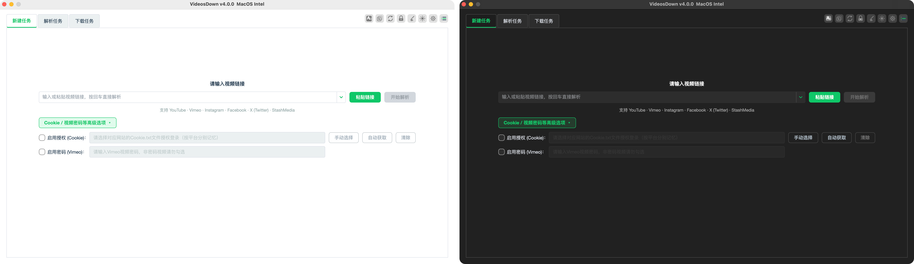
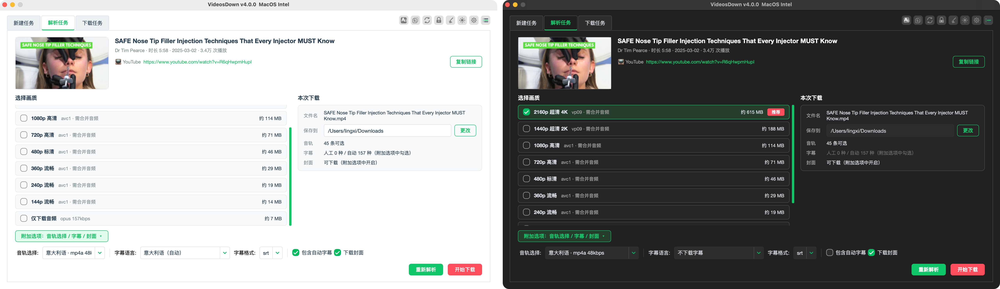
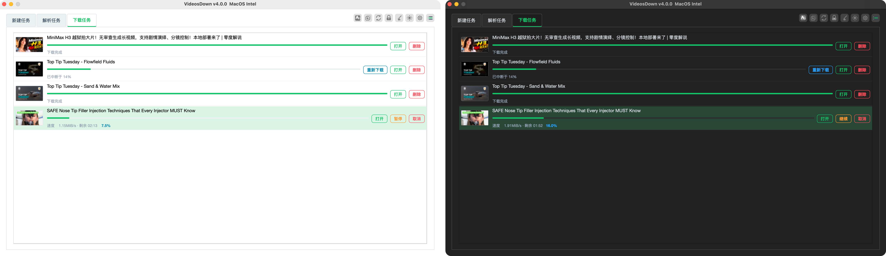
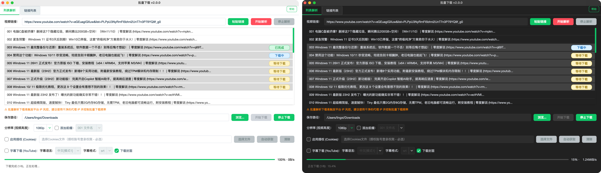
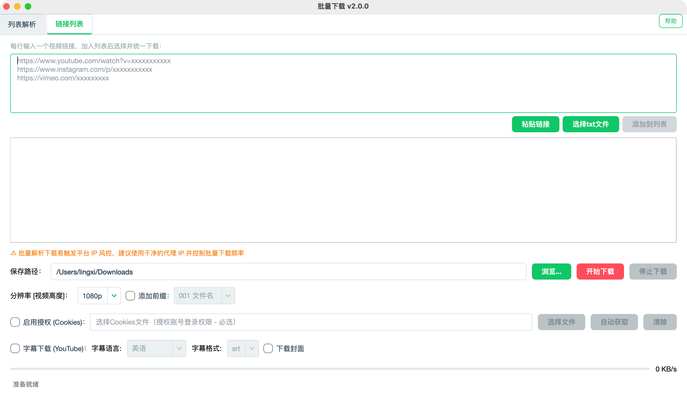
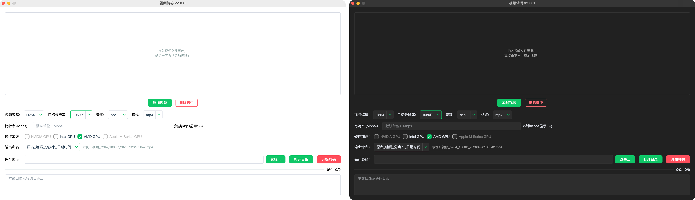
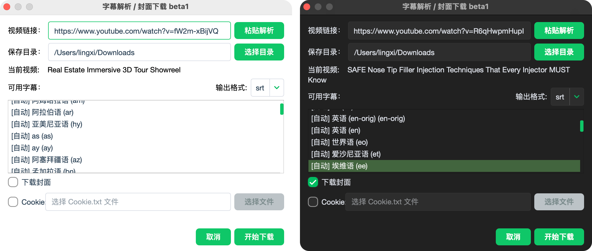
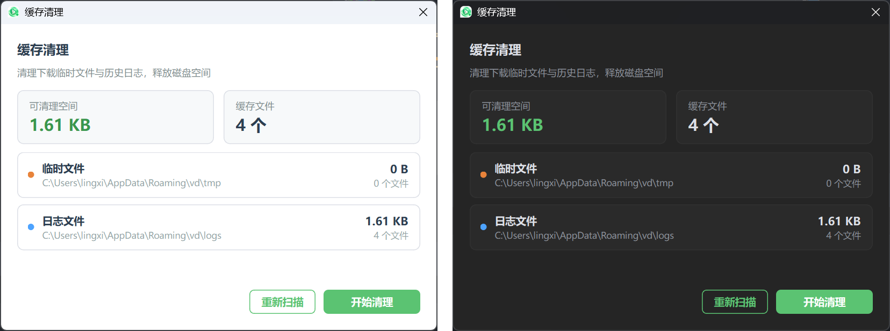

<div align="center">


# VideosDown

**基于 Proprietary 协议的跨平台桌面视频下载工具，内嵌字幕封面独立下载、批量下载与视频转码功能**

[](https://www.aizzx.top/VideosDown)
[](LICENSE.md)
[](#-安装)
[](https://github.com/yt-dlp/yt-dlp)
[](https://doc.qt.io/qtforpython/)

[官网](https://www.aizzx.top/VideosDown) · [获取授权](https://www.aizzx.top/shop/1120.html) · [使用指南](#-使用指南) · [常见问题](#-常见问题) · [为什么选择](#-为什么选择-videosdown) · [从源码构建](#-从源码构建) · [反馈与联系](#-反馈与联系)

<p align="center">
  <br>
  <sub>浅色（左） · 深色（右）</sub>
</p>

</div>

---

## ✨ 功能特性

### 🎬 核心下载

- **三标签工作流**：新建任务（链接输入）→ 解析任务（画质/字幕确认）→ 下载任务（进度管理），流程清晰
- **多平台支持**：YouTube、Vimeo、Instagram、Facebook、X（Twitter）、StashMedia 等主流平台
- **智能解析**：按视频实际可用格式展示画质、编码与预估大小；音轨中文名称显示；字幕列出人工/自动轨，支持 SRT / VTT，不选择则不下载
- 🆕 **重新下载**：中断或失败的任务一键恢复，自动接续已下载的进度，无需重新解析
- **并发队列**：同时下载数量可调（1~6），超出部分自动排队，支持暂停 / 继续 / 取消与实时进度、速度、剩余时间
- **链接历史**：最近解析的链接下拉可选、行内单条删除，容量可在设置中调整（5~30 条）

### 🧰 效率工具

- **批量下载**：支持 YouTube / Vimeo / Instagram 等平台的主页、合集、列表地址批量解析与下载，任务状态实时标识
- **视频转码**：内置 FFmpeg 转码，支持 H264 / H265 / AV1 / VP9 编码、码率、分辨率与 NVIDIA / Intel / AMD / Apple GPU 加速，输出命名支持预设模板与实时示例预览
- **字幕封面独立下载**：单独获取视频的字幕与封面资源
- **功能面板**：代理检测、环境检测、缓存清理、查看日志、更新升级、免责声明、软件帮助、关于软件集中一处

### 🔑 授权与账号

- **Cookie 一键获取**：自动从 Firefox 导出并按平台分别记忆，也支持手动导入 cookies.txt
- **Vimeo 密码视频**：勾选启用密码并输入视频密码即可解析下载
- **卡密授权**：离线宽限期内可正常使用，恢复联网后自动校验；支持自助解绑换机

### 🖥 桌面体验

- 亮色 / 暗色主题、系统托盘、单实例运行（主程序与功能窗口）、Toast 轻通知
- 界面语言跟随系统（右键菜单等标准控件自动中文化）
- 应用内新版本检测与在线升级

## 💡 为什么选择 VideosDown

视频下载确实有不少免费方案：浏览器扩展、命令行工具、各类在线网站等。如果只是偶尔下载一个视频，它们完全够用。但如果您**经常需要下载视频**，VideosDown 能帮您省下大量折腾的时间：

- **开箱即用**：内置 FFmpeg 与 Node.js 运行环境，无需配置命令行、无需试错挑选扩展，安装即用
- **图形化全流程**：解析 → 选画质/字幕 → 下载 → 转码，全部点击完成；支持批量下载、断点续传、任务队列
- **平台适配持续跟进**：各平台防护策略频繁更新，"突然下不了"是常态——本工具持续发布适配更新，无需自己排查
- **人工技术支持**：遇到问题有真人协助排查（官网 / QQ 频道），而不是独自翻文档、逛 issue 区
- **本地运行**：解析与下载均在本地完成，不留存您的账号信息与下载记录

> 一句话总结：偶尔下一个，免费方案足够；高频下载，本工具更省心。

## 📦 安装

推荐从官网或仓库发布页下载预编译版本，安装包已内置 FFmpeg 与 Node.js 运行资源，无需额外配置环境。

| 平台 | 要求 | 获取方式 |
| --- | --- | --- |
| Windows x64 | Windows 10 22H2+（推荐 Win11） | [官网下载](https://www.aizzx.top/VideosDown) |
| macOS Apple Silicon | macOS 11 及以上 | [官网下载](https://www.aizzx.top/VideosDown) |
| macOS Intel | macOS 10.13 及以上 | [官网下载](https://www.aizzx.top/VideosDown) |

> 更多下载渠道（夸克网盘 / 百度网盘，含 Windows 绿色免安装版）见[官方文档](https://www.aizzx.top/20.html)。

> [!NOTE]
> - 首次启动会展示使用协议，同意后进入主界面
> - 关闭主窗口默认最小化到系统托盘，可在「软件设置」中调整
> - 解析 YouTube 等平台需要**系统级代理**（不支持浏览器扩展代理）
> - **macOS 用户**：首次打开应用及首次调用 ffmpeg 等内置组件时，系统会拦截未签名程序，
>   需在「系统设置 → 隐私与安全性」中点击「仍要打开 / 允许」，详见[常见问题](#-常见问题)

## 🚀 快速上手

1. 在「新建任务」粘贴视频链接，按回车或点击「开始解析」
2. 在「解析任务」页选择画质、音轨与字幕（可选），确认保存目录
3. 点击「开始下载」，在「下载任务」页管理进度；中断的任务可随时「重新下载」续传

## 📖 使用指南

主程序采用「新建任务 → 解析任务 → 下载任务」三标签工作流；批量下载与视频转码为独立功能窗口，从主界面工具栏打开。

### 新建任务

- **链接历史**：最近解析的链接下拉可选，行内 `×` 删除单条，「粘贴链接」从剪贴板一键填入
- **高级选项**（默认折叠）：Cookie 授权与 Vimeo 密码，详见 [Cookie 授权](#cookie-授权)

（界面见顶部预览图）

### 解析任务

- **画质 / 音轨 / 字幕**：完全按解析结果展示，中文语言名称，附加选项按功能分组（音轨 ｜ 字幕语言与格式 ｜ 封面）
- **本次下载**：文件名、保存目录与各项能力一览，确认后一键开始

<p align="center">
  <br>
  <sub>浅色（左） · 深色（右）</sub>
</p>

### 下载任务

- **任务信息分层**：名称、百分比、进度条与速度 / 剩余时间各归其位，支持暂停 / 继续 / 取消 / 打开目录 / 删除
- **重新下载**：中断或失败的任务点击后自动续传（无需重新解析、重选画质）
- **并发调度**：超出同时下载数量的任务自动排队，前置任务完成后立即开始

<p align="center">
  <br>
  <sub>浅色（左） · 深色（右）</sub>
</p>

### 批量下载

从工具栏打开独立窗口，适合一次下载整个主页、合集或一批链接：

- **两种输入方式**：粘贴主页 / 合集 / 播放列表地址自动展开为逐个视频；或在文本框中每行一个链接批量加入
- **选择即下载集**：单击选单条、Ctrl 加选/减选、Shift 范围选（与视频转码列表操作一致），点「开始下载」只下载选中项
- **状态实时标识**：每个条目右侧徽章显示等待下载 / 下载中 / 已完成 / 失败等状态
- **Cookie 与参数**：支持 Cookie 自动获取 / 手动导入 / 一键清除（会员内容等场景），可选目标分辨率，保存路径自动记忆
- **风控提醒**：界面常驻 IP 风控提示，建议配合干净的代理 IP 并控制解析频率

<p align="center">
  <br>
  <sub>浅色（左） · 深色（右）</sub>
</p>

<p align="center">
  <br>
  <sub>链接列表模式（浅色）</sub>
</p>

### 视频转码

从工具栏打开独立窗口，对本地视频做格式与参数转换：

- **批量转码**：拖拽或按钮添加多个视频，队列逐个转码，进度条与任务序号实时显示
- **编码与参数**：H264 / H265 / AV1 / VP9 编码，目标分辨率、音频、封装格式（mp4 / mov / mkv）与比特率可选
- **GPU 加速**：自动探测 NVIDIA / Intel / AMD / Apple GPU，按当前编码的可用性启用，转码中参数自动锁定
- **输出命名**：预设模板下拉（保留原文件名 / 编码 / 分辨率 / 日期时间等组合），右侧实时示例预览
- **防覆盖**：输出目录存在同名文件时自动追加序号，不会覆盖已有文件

<p align="center">
  <br>
  <sub>浅色（左） · 深色（右）</sub>
</p>

### 字幕封面

从工具栏打开「字幕封面下载」，不建完整下载任务、单独获取这两类资源：

- **字幕独立下载**：粘贴视频链接，解析实际可用的字幕轨后按需保存
- **封面独立下载**：一键保存视频封面图，无需下载整个视频
- **支持 Cookie**：可加载 Cookie 获取会员 / 受限内容对应的字幕与封面

<p align="center">
  <br>
  <sub>浅色（左） · 深色（右）</sub>
</p>

### 缓存清理

从功能面板打开「缓存清理」，一键释放磁盘空间：

- **空间一目了然**：汇总卡片展示可清理空间与文件总数，临时文件 / 日志文件分列明细
- **一键清理**：清理完成后自动重新扫描，结果即时反馈
- **安全范围**：仅清理下载临时目录与日志目录，不触碰任何下载数据

<p align="center">
  <br>
  <sub>浅色（左） · 深色（右）</sub>
</p>

### Cookie 授权

- **为什么需要 Cookie**：部分平台登录后可解锁更高清晰度（如默认 480P → 1080P/2K/4K）；海外平台 IP 受限时需加载对应 Cookie
- **自动获取**：从已安装的 Firefox 导出 Cookie（Chrome / Edge 因浏览器加密暂不支持）
- **手动导入（三步）**：
  1. 安装浏览器插件 —— Chrome/Edge：[Get cookies.txt LOCALLY](https://chromewebstore.google.com/detail/get-cookiestxt-locally/cclelndahbckbenkjhflpdbgdldlbecc) ｜ Firefox：[cookies.txt by Lennon Hill](https://addons.mozilla.org/en-US/firefox/addon/cookies-txt/)
  2. 在已登录目标网站的浏览器中，用插件导出 cookies.txt（Netscape 格式）
  3. 回到软件勾选「启用授权」，点「手动选择」按钮加载导出的文件
- **按平台记忆**：每个网站的 Cookie 独立保存，可一键清除当前平台记录

## ⚙️ 配置与数据位置

| 平台 | 设置与任务文件 |
| --- | --- |
| Windows | `%APPDATA%/vd/settings.json`、`%APPDATA%/vd/download_tasks.json` |
| macOS | `~/.vd/settings.json`、`~/.vd/download_tasks.json` |

| 平台 | Cookie 与日志目录 |
| --- | --- |
| Windows | `%APPDATA%/vd/cookies/`（自动获取的 Cookie）、`%APPDATA%/vd/logs/` |
| macOS | `~/.vd/cookies/`、`~/.vd/logs/` |

- 设置文件损坏时，应用会自动备份损坏文件并恢复默认配置
- 日志按启动时间分文件保存，自动清理 14 天前的历史日志

## ❓ 常见问题

- **解析失败**：先在「功能面板 → 代理检测」确认代理可用；部分会员内容需加载对应 Cookie
- **提示请求过多（429）**：请求频率过高被平台限流，降低下载频率或更换代理 IP
- **杀毒软件误报**：软件未做数字签名可能被误判，添加信任 / 白名单即可
- **macOS 首次使用被拦截（应用 / ffmpeg 等）**：macOS 会拦截未签名的应用与命令行组件，两类提示分别处理：
  - 应用提示"已损坏"或"无法验证开发者"：
    - ✅ **推荐**：右键应用选择「打开」，或在「系统设置 → 隐私与安全性」中点击「仍要打开」
    - ⚠️ **备用**：终端执行 `sudo spctl --master-disable` 会全局关闭系统门禁（Gatekeeper），处理完建议执行 `sudo spctl --master-enable` 恢复
  - 首次调用 ffmpeg 等内置组件时提示"无法验证开发者"（转码 / 下载封面等首次触发）：
    - ✅ **推荐**：在「系统设置 → 隐私与安全性」中找到被拦提示，点击「仍要打开 / 允许」后重试
    - 🔧 **备用**：终端对软件内的组件去除隔离标记（只影响本软件，不改系统设置）：
      `xattr -rd com.apple.quarantine "/Applications/VideosDown.app"`
- **下载的视频播放异常**：部分编码视频常规播放器不支持解码，推荐使用 PotPlayer（Windows）/ IINA（macOS）播放
- **换电脑**：可在「卡密中心」自助解绑换机，规则详见[官方文档](https://www.aizzx.top/20.html)

## 🔑 授权体系

### 使用授权（软件功能）

- 软件内点击工具栏「卡密中心」，输入卡密激活
- 卡密与设备绑定，可在卡密中心自助解绑换机
- 基础版一机一码，专业版一码两机；Windows 绑定主板板载物理网卡（更换网络环境不受影响），macOS 绑定设备序列号；不支持虚拟机、软路由等虚拟设备绑定
- 获取与购买：[商城](https://www.aizzx.top/shop/1120.html) ｜ [官网](https://www.aizzx.top/VideosDown)

### 源码授权（二次开发）

- 面向有二次开发、深度集成或私有化部署需求的用户
- 授权后获得源码仓库访问权限，可在仓库内查看、研究源码，并**为自身使用目的进行二次开发与部署**（修改、扩展、构建自用版本）
- 边界：二次开发成果**自用**，不得对外再分发、公开上传或转售源码及其衍生版本；不得移除版权声明与授权校验机制；具体权利范围以授权凭证约定为准
- 获取方式：通过[官网](https://www.aizzx.top/VideosDown)或 [QQ 频道](https://pd.qq.com/s/5in20hyp0)联系开发者评估，确认书面授权后开通仓库访问，构建流程见下方「从源码构建」

## 🔨 从源码构建

> [!IMPORTANT]
> 本节面向**已获得源码授权**的用户：源码不随软件公开分发，请先按上方「源码授权」
> 取得书面授权并开通仓库访问，再进行以下步骤。
> 构建前请完整阅读并同意 [LICENSE.md](LICENSE.md)（专有许可：未经**源码授权**者禁止复制、
> 修改、再分发与商业用途；已获源码授权者按授权凭证范围执行）。
> **你执行克隆 / 下载操作，即视为已接受许可的全部条款。**

### 获取源码

**方式一：Git 克隆（推荐，便于后续更新）**

```bash
git clone https://gitee.com/xxxxxx/videosdown.git            # 主仓库（Gitee）-获取授权后可见具体地址
git clone https://github.comxxxxxx/VideosDown-Private.git   # 备用仓库（GitHub）-获取授权后可见具体地址
cd VideosDown
git checkout feat         # 当前新功能方向分支
git checkout dev         # 当前开发分支
git checkout main       # 当前主线分支
```

**方式二：下载压缩包**

在仓库页面点击「克隆 / 下载 → 下载 ZIP」解压即可（不含 Git 历史，后续更新需重新下载）。

### 环境准备与运行

> [!NOTE]
> 仓库**不包含** FFmpeg 与 Node.js 运行时（已被 `.gitignore` 排除），首次构建前需自行准备：
> - 下载 [FFmpeg](https://ffmpeg.org/download.html) 与 [Node.js](https://nodejs.org/) 对应平台的版本
> - 放置到 `app/resources/win/`（Windows：`ffmpeg.exe`、`nodejs/node.exe`）
>   或 `app/resources/mac/`（macOS：`ffmpeg`、`nodejs/bin/node`）
> - 也可以直接从官方预编译安装包中复制这两个目录

```bash
# 1. 创建虚拟环境（Python 3.13+）
python3 -m venv .venv
source .venv/bin/activate        # Windows: .venv\Scripts\activate

# 2. 安装依赖
pip install -r requirements.txt

# 3. 运行
python videosdown.py
```

## 📄 许可证与声明

本软件以**专有许可协议（EULA）**提供，完整许可文本见 [LICENSE.md](LICENSE.md)。

> [!IMPORTANT]
> - 自 **4.0.0 版本**起，许可由 MIT 变更为专有许可（EULA）：可安装使用未经修改的软件副本，
>   **禁止**复制分发、修改衍生、反向工程或用于商业用途，也禁止绕过授权校验机制
> - 此前以 MIT 发布的历史版本快照仍按 MIT 授予，不受本次变更追溯影响
> - 使用完整功能需要获取卡密授权（新用户含免费试用）；安装包与更新通过官网 / 授权渠道分发
> - 本项目使用的第三方组件（PySide6 / FFmpeg / yt-dlp / Node.js / Nuitka）遵循其各自的开源许可，
>   详见 [LICENSE.md](LICENSE.md) 的「第三方组件许可」小节

完整使用协议在首次启动时展示，也可在「功能面板 → 免责声明」中随时查看；
安装包附带的使用协议见 `LICENSE.txt`（与安装器集成）。

## 🙏 致谢与开源组件

本软件基于以下优秀的开源项目构建，各组件遵循其原始许可，与本项目相互独立：

| 组件 | 用途 | 许可 |
| --- | --- | --- |
| [yt-dlp](https://github.com/yt-dlp/yt-dlp) | 媒体信息解析与下载核心 | Unlicense（公有领域） |
| [FFmpeg](https://ffmpeg.org/) | 媒体解析、合并与转码 | LGPL/GPL（以实际分发构建为准） |
| [PySide6（Qt for Python）](https://doc.qt.io/qtforpython/) | 桌面图形界面 | LGPLv3（动态链接方式使用） |
| [Node.js](https://nodejs.org/) | yt-dlp 运行时支持 | MIT 等宽松许可 |
| [Nuitka](https://nuitka.net/) | 独立应用打包 | Apache 2.0 |

各组件的完整许可条款与分发义务说明（含 LGPLv3 重链接权利）见 [LICENSE.md](LICENSE.md) 的「第三方组件许可」小节。

## 💬 反馈与联系

- 官网与帮助文档：<https://www.aizzx.top/20.html>
- QQ 频道：<https://pd.qq.com/s/5in20hyp0>
- 问题反馈时请附上「功能面板 → 查看日志」中的相关日志内容
